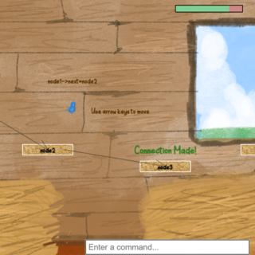

# Game Name

Linkin' Chickin

# Team Color

Blue

# Developers

* Soffie Paul (soffie@udel.edu)
* Grace Donaher (gdonaher@udel.edu)

# Blurb

Baby Blue, an outcast blue chick, is searching for his missing Mama — and he needs your help!

You’ll jump across platforms and collect items to reach your goal, but there’s a catch: platforms must be linked together before Baby Blue can travel across them. It’s up to you to type or press the right buttons to connect each platform and hop your way out of each level. Along your journey, you’ll add, remove, and reconnect platforms using linked list commands taught by the wise dinosaur ancestor, Trina Saurus Rex.

Explore each new horizon, reach the final platform, and reunite Baby Blue with his Mama!

# Basic Instructions

Connect platforms by entering the right commands into the command box - you can type the command or click on buttons to insert them for you. Each command determines your platform's "next" or "previous" reachable location. Think of "next" as forwards and "previous" as backwards. Once the arrow points to the right platform, jump to it using the arrow keys. Make sure you've connected them correctly and try not to fall off! Sometimes, you might have to insert a new platform, delete one, or collect all the items before you can venture forth. Make your way to the last platform until you find Mama!

# Screenshot

# Gameplay Video

# Educational Game Design Document

Link to our [egdd](https://github.com/soffie-chan/egdd/blob/main/index.md)

# Credits
+ Music
	- Lud and Schlatt's Musical Emporium
		* [Ludwig's Lullaby](https://youtu.be/dAgKV5_cegI?si=zVU6Ph-CEstQlwwD)
		* [Sunset Pier](https://youtu.be/nvFyOpBv2Bs?si=N3uYsAiT4bT8-ODU)
		* [2 PM](https://youtu.be/0dW17XShyy4?si=kF02FGH1s2GCbC-G)
		* [We Shop Song](https://youtu.be/Y-6Plfn1yHg?si=9cv9nt2ZHtV9GYF2)
		* The music above was not modified when used. [Click to view the Creative Commons License.](https://creativecommons.org/licenses/by/3.0/)

	- [Kuukiko - Sunrise of Youth](https://youtu.be/MC_rB594VsM?si=W5es5VevozpmChuq)
		* The music above was cut to half its size when used (0:36-1:13). [Click to view the Creative Commons License.](https://creativecommons.org/licenses/by/3.0/)
  
+ Sound Effects
  - [Beep](https://pixabay.com/sound-effects/film-special-effects-game-start-317318/)
  - [Tiny, pitiful chirps](https://pixabay.com/sound-effects/nature-short-chick-sound-171389/)

+ Font
	- [Rahagita Studio - Child Hood Font](https://www.1001fonts.com/child-hood-font.html)
	- [Annnaria - Clear Doodle Font](https://www.1001fonts.com/clear-doodle-font.html)

+ Assets
	- [stereoscopic - Grass Texture](https://opengameart.org/content/grass-1)
	- [RedBirdTheCardinal - Hay Texture](https://opengameart.org/content/hay-0)
	- [Keith333 - Brick Texture](https://opengameart.org/content/gray-brick-wall-seamless-texture-with-normalmap)
	- Pinterest - Dinosaur images used as stencils.

Thank you! :)
